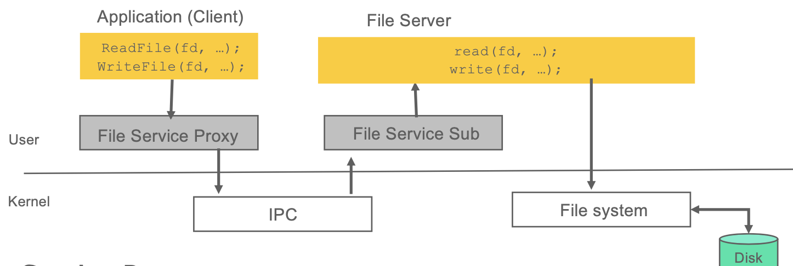

## File Server (파일 서버)

&nbsp;&nbsp;&nbsp;&nbsp;&nbsp;&nbsp;&nbsp;&nbsp;&nbsp;&nbsp;&nbsp;&nbsp;&nbsp;&nbsp;&nbsp;&nbsp;&nbsp;&nbsp;&nbsp;&nbsp;&nbsp;&nbsp;&nbsp;&nbsp;&nbsp;&nbsp;&nbsp;&nbsp;&nbsp;&nbsp;&nbsp;&nbsp;&nbsp;&nbsp;&nbsp;&nbsp;&nbsp;&nbsp;&nbsp;&nbsp;&nbsp;&nbsp;&nbsp;&nbsp;&nbsp;&nbsp;&nbsp;&nbsp;&nbsp;&nbsp;&nbsp;&nbsp;&nbsp;&nbsp;&nbsp;&nbsp;&nbsp;&nbsp;&nbsp;&nbsp;*2018-2 시스템소프트웨어 프로젝트*

**일반적인 서버-클라이언트 모델은 RPC(Remote Procedure Call)이다.**

**RPC와 동일하나 원격이 아닌 동일 컴퓨터 내에서 동작이 이루어지는 LPC (Local Procedure Call) File Server를 구현**

**File Server를 Message Queue, Shared Memory 두 가지 방식으로 구현**

 

- **구현한 기능 소개**
  - File Service Proxy - Client의 요청을 Filer Server로 송신
  - File Service Stub - 전달된 요청을 분해하고 대응하는 System Call을 호출
  - 디렉토리 생성, 제거 요청
  - 파일 생성, 읽기, 쓰기, 닫기 요청

 

- **사용한 언어 및 도구, 라이브러리**
  + C
  + Unix System Call

 

+ **개발 환경**
  + Ubuntu Linux 16.04
  + Visual Studio Code

 

- **시스템 구성도**

  </img>

---

> 2019.11.15 최종 업데이트
>
> 광운대학교 소프트웨어학부 윤홍찬

